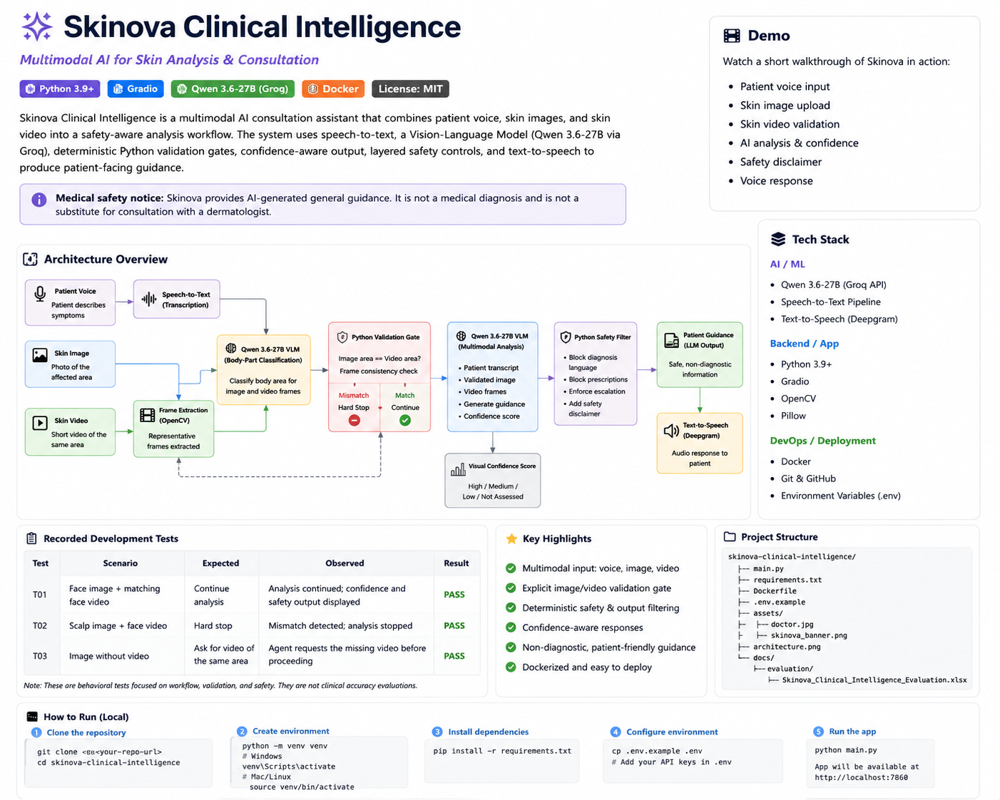

# Skinova Clinical Intelligence

## Multimodal AI for Skin Analysis & Consultation


Skinova Clinical Intelligence is a **multimodal AI consultation assistant** that combines patient voice, skin images, and skin video into a single, safety-aware analysis workflow.

The system uses **speech-to-text, a Vision-Language Model (VLM), deterministic Python validation gates, confidence-aware output, layered safety controls, and text-to-speech** to produce concise patient-facing guidance.

> **Medical safety notice:** Skinova provides AI-generated general guidance. It is not a medical diagnosis and is not a substitute for consultation with a dermatologist.

---


## 🚀 Live 


**Public deployment:**  
[https://skinova-clinical-intelligence.onrender.com](https://skinova-clinical-intelligence.onrender.com)


---


## 🎥 Demo Video


https://github.com/user-attachments/assets/fb687f78-9445-46a1-954d-ef49ef45d373


---


## Product Overview

Skin consultations often contain multiple sources of information: what the patient says, what is visible in a still image, and what changes across a short video.

Skinova is designed around that multimodal workflow.

Instead of sending every input directly to an LLM and trusting a free-text response, the system separates:

**AI perception and language** from **deterministic application logic and safety gates**.

This makes the workflow easier to inspect, test, and evolve.

---

## Key Capabilities

### Multimodal patient input
- Patient voice recording or upload
- Skin image upload
- Optional skin video upload / webcam capture

### AI / VLM analysis
- Speech-to-text for the patient description
- Vision-language analysis using **Groq + Qwen3.6-27B**
- Visible-finding extraction with cautious language
- Patient-facing response generation

### Explicit media validation
- Separate body-part classification for the patient image
- Representative video-frame extraction using OpenCV
- Body-part classification on video frames
- Deterministic Python image/video consistency check
- Hard stop when the uploaded media refers to different body areas

### Confidence-aware output
- High
- Medium
- Low
- Not assessed

The confidence label represents **confidence in the visual assessment**, not diagnostic probability.

### Safety layer
- Prominent non-diagnostic disclaimer
- Confidence-aware caution messaging
- Conservative escalation messaging
- Deterministic post-processing of patient-facing output
- No prescription antibiotics, steroids, or prescription medicines
- No definitive diagnosis claims

### Voice response
- Final patient-facing text is converted to audio
- The same sanitized response is used for UI and TTS

### Deployment
- Dockerized application
- Environment-based secret management
- GitHub-ready project structure

---

## Architecture



### End-to-end pipeline

```text
Patient Voice
      │
      ▼
Speech-to-Text
      │
      ├──────────────────────────┐
      ▼                          │
Patient Image                   │
      │                          │
      ▼                          │
Body-Part Classification        │
                                 │
Patient Video ──► Frame Extraction
                         │
                         ▼
                Body-Part Classification
                         │
                         ▼
              ┌───────────────────────┐
              │ Python Validation Gate│
              │ Image area == Video?  │
              └──────────┬────────────┘
                         │
               ┌─────────┴─────────┐
               │                   │
           MISMATCH              MATCH
               │                   │
           HARD STOP               ▼
               │          Vision / VLM Analysis
               │                   │
               │                   ▼
               │          Visual Confidence
               │                   │
               │                   ▼
               └──────────► Safety + Output Filter
                                   │
                                   ▼
                           Patient Guidance
                                   │
                                   ▼
                                  TTS
```

---

## AI / ML Stack

### Vision-Language Model
**Qwen3.6-27B via Groq**

Used for:
- bounded body-part classification
- visual finding interpretation
- cautious patient-facing language generation

### Speech
- Speech-to-text pipeline
- Deepgram / voice services
- Text-to-speech pipeline

### Multimodal processing
- OpenCV for representative video-frame extraction
- Pillow for image processing and contact-sheet generation

---

## Engineering Responsibility Split

A central design principle in Skinova is:

> **The LLM interprets. Deterministic Python logic controls workflow gates.**

### LLM / VLM responsibilities

```text
Image / frame
    ↓
"What body area is visible?"
    ↓
"What findings are visibly present?"
    ↓
"How can those findings be explained cautiously?"
```

### Python responsibilities

```python
if image_body_part != video_body_part:
    stop_analysis()
```

Python controls:
- orchestration
- validation gates
- mismatch hard-stop
- confidence routing
- safety presentation
- deterministic output sanitization
- TTS handoff

This avoids making a paragraph-level LLM response the sole authority for an important workflow decision.

---

## Why the Validation Layer Matters

A prompt-only prototype can ask a model:

> "Do the image and video show the same affected area?"

That can work, but the final business decision remains embedded inside a probabilistic LLM response.

Skinova instead uses:

```text
Image → body_part = scalp
Video → body_part = face

Python:
scalp != face

→ HARD STOP
```

This creates a **deterministic, testable validation gate** before the medical-analysis stage.

---

## Safety Architecture

Skinova applies multiple layers rather than relying only on a system prompt.

### Layer 1 — Prompt constraints
- No definitive diagnosis
- Conservative language
- No prescription medicines
- No unsupported symptoms

### Layer 2 — Media validation
Mismatch between image and video prevents the medical-analysis stage from continuing.

### Layer 3 — Confidence
Low or incomplete visual evidence can be surfaced as lower confidence.

### Layer 4 — UI safety
A persistent banner states:

> **AI-generated guidance — not a medical diagnosis. Please consult a dermatologist for a professional evaluation.**

### Layer 5 — Output guard
Patient-facing output is sanitized before it is displayed and converted to audio.

---

## Tech Stack

| Layer | Technology |
|---|---|
| Language | Python |
| UI / App | Gradio |
| Vision-Language Model | Qwen3.6-27B via Groq |
| Speech-to-Text | Speech / Deepgram pipeline |
| Text-to-Speech | Voice synthesis pipeline |
| Computer Vision | OpenCV |
| Image Processing | Pillow |
| Containerization | Docker |
| Version Control | Git / GitHub |
| Secrets | Environment variables |

---

## Project Structure

```text
skinova-clinical-intelligence/
│
├── main.py
├── brain_of_the_doctor_groq.py
├── brain_of_the_doctor.py
├── voice_of_the_patient.py
├── voice_of_the_doctor.py
├── free_text_to_speech.py
│
├── requirements.txt
├── Dockerfile
├── .dockerignore
├── .gitignore
├── .env.example
│
├── assets/
│   ├── doctor.jpg
│   └── skinova_banner.png
│
├── docs/
│   └── evaluation/
│       └── Skinova_Clinical_Intelligence_Evaluation.xlsx
│
├── architecture.svg
└── README.md
```

---

## Run Locally

### Python

Install dependencies:

```bash
pip install -r requirements.txt
```

Set environment variables in `.env`:

```text
GROQ_API_KEY=your_key
DEEPGRAM_API_KEY=your_key
OPENROUTER_API_KEY=your_key
MINIMAX_API_KEY=your_key
```

Run:

```bash
python main.py
```

Open:

```text
http://localhost:7860
```

---

## Run with Docker

Build:

```bash
docker build -t skinova-clinical-intelligence .
```

Run:

```bash
docker run --env-file .env -p 7860:7860 skinova-clinical-intelligence
```

Open:

```text
http://localhost:7860
```

### Secrets

Never commit `.env`, API keys, or generated credentials to GitHub.

Use `.env.example` only as a public template.

---

## Evaluation

Skinova is currently evaluated primarily for:

- behavioral correctness
- multimodal consistency
- uncertainty handling
- safety behavior
- workflow correctness

This is **not a clinical diagnostic accuracy study**.

### Recorded development tests


The following scenarios were actually exercised during development:

| Test | Scenario | Expected | Observed | Result |
|---|---|---|---|---|
| T01 | Face image + matching face video | Continue analysis | Analysis continued; confidence and safety output displayed | **PASS** |
| T02 | Scalp image + face video | Hard stop | Mismatch detected; analysis stopped | **PASS** |
| T03 | Image uploaded without video | Request a short video of the same affected area | Agent requested the missing video before proceeding | **PASS** |
| T04 | Non-skin input (technical/project image) | Do not perform skin assessment | Input identified as non-skin content; visual assessment stopped; confidence shown as Not Assessed | **PASS** |

These tests cover the main success path, multimodal mismatch safety gate, and missing-input handling.

> **Note:** These are behavioral tests focused on workflow, validation, and safety. They are not clinical diagnostic accuracy evaluations.

## Screenshots

### T01 — Matching Media

Face image + matching face video → analysis continues with confidence and safety output.


### T02 — Media Mismatch

Hand/scalp image + face video → deterministic validation detects the mismatch and stops analysis.


### T03 — Missing Video

Image uploaded without video → Skinova requests a short video of the same affected area before proceeding.


### T04 — Non-Skin Input

A non-skin technical image is rejected from visual skin assessment, with confidence shown as **Not Assessed**.


---

## Error Handling & Edge Cases

Skinova is designed to handle common multimodal failure scenarios explicitly rather than relying only on the LLM response.

| Scenario | System Behavior |
|---|---|
| Image and video show different body areas | Python validation gate stops analysis and asks for a matching video |
| Image uploaded without video | System requests a short video of the same affected area before proceeding with full assessment |
| Visual assessment cannot be completed | Confidence is shown as **Not Assessed** and the user is advised to consult a dermatologist |
| Low visual confidence | System surfaces lower confidence and avoids presenting the result as a diagnosis |
| Concerning wording in generated guidance | Safety layer adds stronger professional-evaluation messaging |
| External API rate limiting | API requests may be retried before the workflow continues or fails gracefully |
| Invalid / incomplete analysis output | Response handling falls back to a safe patient-facing message rather than exposing raw model output |

### Engineering Challenges & Solutions

**1. Multimodal mismatch**  
A user can upload a scalp image and a face video. Instead of asking the LLM to make a vague final decision, Skinova performs a separate body-part classification and uses a deterministic Python gate to stop the workflow when the media is inconsistent.

**2. LLM safety is not sufficient on its own**  
Prompt instructions can reduce unsafe output, but they are not the only control. Skinova adds deterministic post-processing and a persistent safety disclaimer before the final response reaches the user and the TTS layer.

**3. Uncertain visual input**  
Poor or incomplete media should not appear equally trustworthy as a clear image. Skinova exposes visual confidence and distinguishes `High`, `Medium`, `Low`, and `Not Assessed`.

**4. Missing multimodal context**  
When only an image is provided, the system does not pretend that video-based context exists. It asks the user to provide a video of the same affected area.


---

## Known Limitations

- Skinova is not a clinical diagnostic system.
- Visual confidence is not diagnostic probability.
- Results depend on image/video quality and model behavior.
- Additional automated regression coverage is still being expanded.
- Formal clinical validation would require an appropriate labeled dataset and study design.

---

## Development Roadmap

### Completed
- Multimodal voice/image/video workflow
- Video frame extraction
- Explicit body-part validation
- Image/video mismatch hard stop
- Visual confidence
- Prominent safety disclaimer
- Deterministic output safety filter
- Dockerized local deployment
- Behavioral evaluation documentation
- Explicit non-skin input rejection


### Next
- Expand automated evaluation coverage
- Add automated regression tests
- Improve structured observability
- Public deployment
- Optional Salesforce integration

---

## Portfolio Highlights

### Problem
A skin-analysis assistant needs more than a single image-to-text prompt when the consultation includes voice, image, and video.

### Solution
Skinova combines multimodal AI with deterministic Python workflow controls.

### Engineering highlights
- **Multimodal:** voice + image + video
- **VLM:** Qwen3.6-27B through Groq
- **Validation:** independent body-part classification + deterministic Python gate
- **Safety:** layered prompts + UI disclaimer + output sanitization
- **Confidence:** visual-assessment confidence surfaced to the user
- **Deployment:** Dockerized and reproducible
- **Evaluation:** documented behavioral test cases

---

## Medical Disclaimer

Skinova Clinical Intelligence is a portfolio/engineering project intended to demonstrate multimodal AI system design.

It does not provide medical diagnoses or replace professional medical care.

**Please consult a dermatologist for a professional evaluation.**
